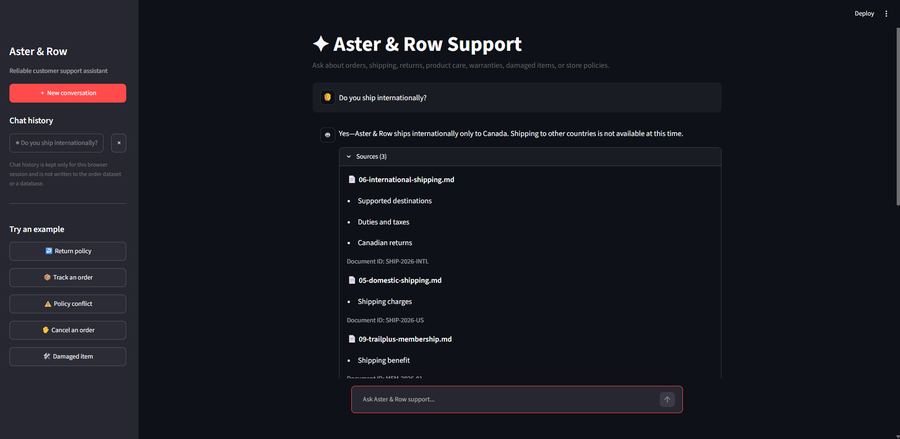
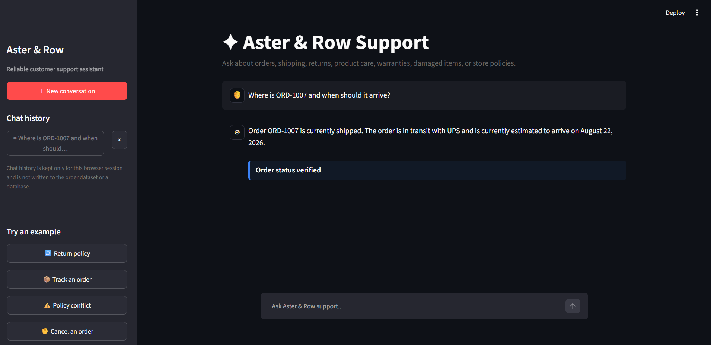
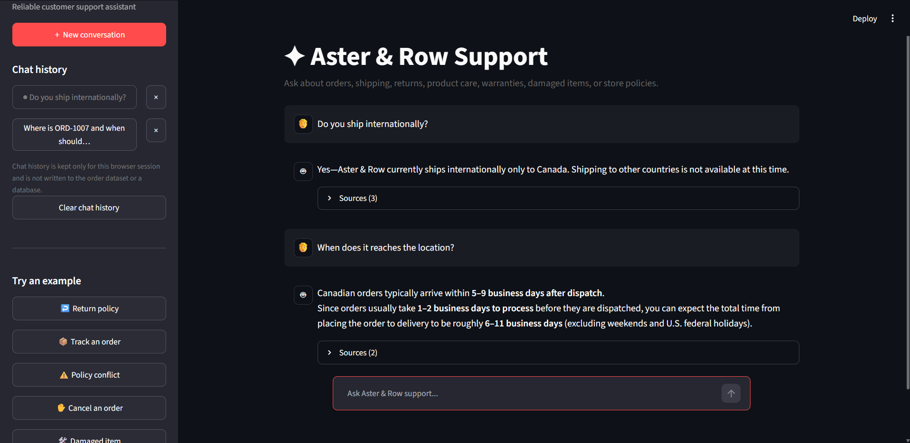
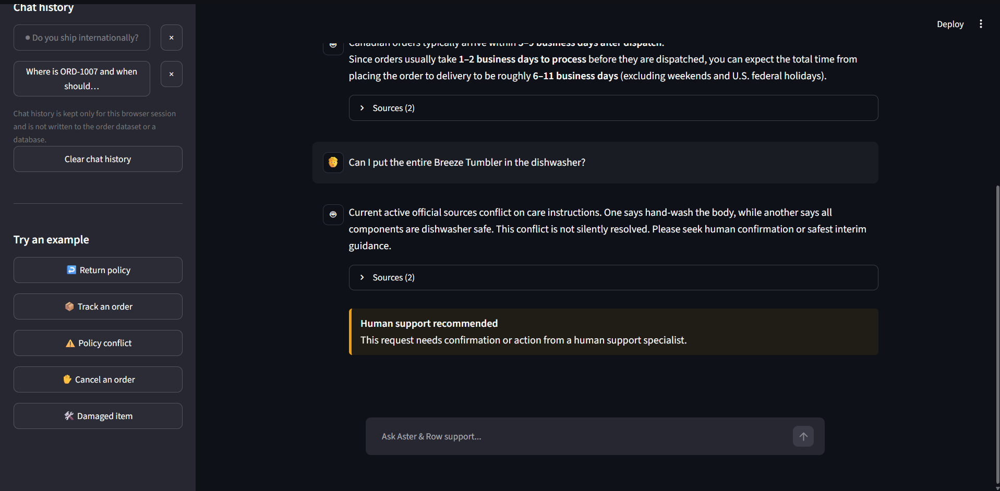
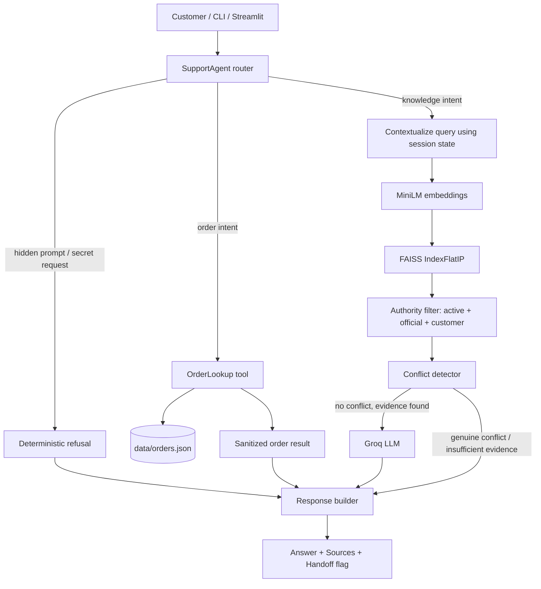

# AsterGuard — Reliable RAG Support Agent for Aster & Row

> Take-home project: a reliability-first customer-support agent built over a Markdown knowledge base and mock order data for the fictional ecommerce company **Aster & Row**.

AsterGuard answers policy and product questions strictly from a governed knowledge base, looks up order status through a privacy-safe tool, keeps lightweight multi-turn context, and **refuses to guess** when sources conflict, evidence is missing, or a request crosses a privacy boundary.

The project optimizes for **groundedness, deterministic safety checks, source authority, privacy, and regression coverage** — not feature count or UI polish.

---

## Demo

*Screenshots — one per required scenario: a knowledge-base answer with citations, an order lookup, a multi-turn follow-up, and a safe refusal / handoff.*

| Knowledge-base answer with citations | Order lookup |
|---|---|
|  |  |

| Multi-turn follow-up | Conflict → handoff |
|---|---|
|  |  |

> [!TIP]
> **Demo video (2–4 min):** [Watch the walkthrough](https://drive.google.com/file/d/1VDIp3c6s9KDI6ZV8jJHCgjvuUXDBdI1S/view?usp=sharing)
>
> Covers: a cited knowledge answer → an order lookup → a multi-turn follow-up → the Breeze Tumbler conflict handoff → the evaluation suite running end-to-end.

---

## Table of Contents

- [What It Does](#what-it-does)
- [Reliability Principles](#reliability-principles)
- [Tech Stack](#tech-stack)
- [Architecture](#architecture)
- [Setup From a Clean Clone](#setup-from-a-clean-clone)
- [Environment Variables](#environment-variables)
- [Running the App](#running-the-app)
- [Evaluation & Results](#evaluation--results)
- [Bug Diary](#bug-diary)
- [Requirement Coverage](#requirement-coverage)
- [Known Limitations](#known-limitations)
- [Production Improvements](#production-improvements)
- [AI Coding Tools Used](#ai-coding-tools-used)
- [Repository Structure](#repository-structure)

---

## What It Does

| Category | Example | Behavior |
|---|---|---|
| **Knowledge-base Q&A** | "What is the standard return window?" | Answers only from retrieved evidence, cites `filename + heading` |
| **Order lookup** | "Where is ORD-1007?" | Looks up one order via a tool; the model never sees the full `orders.json` |
| **Multi-turn follow-up** | "Where is ORD-1007?" → "When will it arrive?" | Resolves the follow-up using bounded session state, no re-asking |
| **Unsupported action** | "Cancel my order" | Explains current status/policy, sets `handoff=True` — never claims the action was completed |
| **Safe refusal / conflict** | "Can I put the Breeze Tumbler in the dishwasher?" | States the conflict, cites both sources, recommends a human instead of guessing |

---

## Reliability Principles

The four failure modes named in the assignment brief map directly to design decisions:

| Reported problem | How AsterGuard addresses it |
|---|---|
| Conflicting policy answers | A deterministic **source-authority filter** (`status=active`, `policy_authority=official`, `audience=customer`) prefers current official docs over superseded/draft ones; genuine conflicts between two current sources are **surfaced, not silently resolved** |
| Invented order info | Order facts come **only** from `OrderLookup`, a narrow read-only tool returning a sanitized field whitelist — the raw `orders.json` never reaches the LLM |
| Lost conversation context | A compact, bounded `AgentState` (current order ID, last knowledge query, last topic, max 8 turns) resolves recognized follow-ups without replaying full history into every query |
| Unsafe retrieved content | Retrieved passages and user messages are treated as **untrusted data**; the system prompt explicitly instructs the model to ignore instructions embedded in documents, and non-customer-facing content can never become authority |

---

## Tech Stack

| Layer | Choice |
|---|---|
| Language | Python |
| LLM | Groq's OpenAI-compatible Chat Completions API (`app/llm/groq_llm.py`), model set via `MODEL_NAME` (`openai/gpt-oss-20b`) |
| Embeddings | `sentence-transformers` (`all-MiniLM-L6-v2`), normalized vectors |
| Vector storage | Local FAISS `IndexFlatIP` (normalized inner product = cosine similarity) |
| Document parsing | PyYAML front matter + heading-aware Markdown chunking |
| Interface | CLI (primary) + an optional Streamlit UI |
| Testing | `pytest` — 74 tests |
| Evaluation | Deterministic behavior assertions against the real agent — no LLM-as-judge |
| Observability | Sanitized JSONL trace (`logs/agent.jsonl`) via `--debug` |

---

## Architecture



**Request flow, briefly:** route deterministically (order / knowledge / blocked) → run only the needed capability → apply authority filtering and conflict detection before generation → build the response from approved evidence only → update bounded session state.

Two design choices carry most of the reliability weight:

- **Retrieval is filtered by authority before generation, not just ranked by similarity.** A chunk can score well and still be excluded if it isn't active/official/customer-facing.
- **Order data never reaches the model whole.** The tool returns a narrow, privacy-safe projection, and cancelled/returned orders have stale ETA/carrier fields stripped before the response is built.

---

## Setup From a Clean Clone

**Prerequisites:** Python 3.11+, and a Groq API key for LLM generation.

```bash
# 1. Clone
git clone https://github.com/shreya-555/AsterGuard-Reliable-RAG-Support-Agent-for-Aster-Row.git
cd .\AsterGuard-Reliable-RAG-Support-Agent-for-Aster-Row

# 2. Create and activate a virtual environment
python -m venv .venv
source .venv/bin/activate        # Windows: .\.venv\Scripts\Activate.ps1

# 3. Install dependencies
python -m pip install --upgrade pip
pip install -r requirements.txt

# 4. Configure environment
cp .env.example .env
# then add your real GROQ_API_KEY to .env

# 5. Build the retrieval index
python -m ingestion.build_index

# 6. Run the tests
pytest -q

# 7. Run the agent
python cli.py

# 8. Optional browser UI
streamlit run streamlit_app.py
```

---

## Environment Variables

| Variable | Required | Default | Purpose |
|---|:---:|---|---|
| `GROQ_API_KEY` | yes | — | Groq API credential |
| `MODEL_NAME` | no | `openai/gpt-oss-20b` | model served through Groq |
| `EMBEDDING_MODEL` | no | `all-MiniLM-L6-v2` | sentence-transformers model for retrieval |

`.env.example`:

```dotenv
GROQ_API_KEY=your_real_key_here
MODEL_NAME=openai/gpt-oss-20b
EMBEDDING_MODEL=all-MiniLM-L6-v2
```


## Running the App

```bash
python cli.py                  # CLI
python cli.py --debug          # CLI with sanitized JSONL trace logging
streamlit run streamlit_app.py # optional browser UI
```

Debug mode writes `logs/agent.jsonl`, capturing the message, bounded history, retrieved chunks with scores, tool calls, sanitized results, and the final answer/sources/handoff — with sensitive keys, email addresses, and gift-card codes redacted recursively.

---

## Evaluation & Results

22 test cases (15 supplied + 7 original), scored with deterministic assertions — required/forbidden sources, tool calls and arguments, forbidden disclosures, handoff correctness, abstention, and grounded concepts. No LLM judges the agent.

```bash
python -m evaluation.evaluate --agent baseline --cases all --output evaluation/baseline-results.json
python -m evaluation.evaluate --agent final --cases all --output evaluation/final-results.json
```

| Category | Baseline (naive RAG) | Final (AsterGuard) |
|---|:---:|:---:|
| Retrieval | 0 / 5 | **5 / 5** |
| Groundedness | 1 / 5 | **5 / 5** |
| Tool use | 3 / 8 | **8 / 8** |
| Privacy | 1 / 4 | **4 / 4** |
| Multi-turn | 1 / 1 | **1 / 1** |
| **Overall** | **6 / 22 (27%)** | **22 / 22 (100%)** |

The baseline (`evaluation/baseline_agent.py`) is a deliberately naive semantic-only RAG pipeline — no authority filtering, no conflict detection, no privacy sanitization beyond a raw lookup, and no multi-turn memory — kept in the repo to show what the added engineering actually fixes.

**Unit tests:** `pytest -q` → **74 / 74 passing.**

---

## Bug Diary

**1 — YAML dates broke index serialization**
- **Repro:** build the index after parsing front matter containing `effective_date: 2026-05-01`.
- **Root cause:** `yaml.safe_load` converts ISO dates into Python `date` objects, which aren't JSON-serializable when writing FAISS chunk metadata.
- **Fix:** normalize `date`/`datetime` metadata to ISO strings recursively during parsing.
- **Regression test:** `test_front_matter_dates_are_json_serializable_strings`

**2 — Unit tests passed but real retrieval crashed**
- **Repro:** run the CLI and ask *"What is the standard return window?"* against the real built index.
- **Root cause:** early mock fixtures used a `content` key while ingestion actually persisted `text` — the mock and real schema had drifted.
- **Fix:** standardized on `content` with a backward-compatible `text` fallback in the retriever.
- **Regression tests:** `test_retriever_accepts_real_chunk_schema`, `test_heading_aware_chunk_schema_uses_content_key`
- *Found through manual exploration beyond the supplied visible-case wording.*

**3 — Order follow-ups silently lost context**
- **Repro:** *"Where is ORD-1007?"* → *"When will it arrive?"*
- **Root cause:** `_handle_order_request(message, order_id, state)` received `order_id` and `message` in reversed argument order, so `current_order_id` never updated.
- **Fix:** corrected the call signature and added explicit tool/state assertions.
- **Regression tests:** `test_order_lookup_is_used`, `test_order_follow_up_uses_previous_order`

**4 — Broad shipping words could inherit stale order context**
- **Repro:** discuss an order, then ask a general shipping-policy question in the same session.
- **Root cause:** follow-up detection relied on broad token overlap (e.g. "shipping") rather than specific order-reference phrases.
- **Fix:** narrowed follow-up phrases and explicitly clear stored order context on topic switch.
- **Regression test:** `test_knowledge_topic_clears_stale_order_context`

---

## Requirement Coverage

<details>
<summary>Full checklist (click to expand)</summary>

**RAG**
- [x] Split/index supplied Markdown, preserve front matter
- [x] Retrieve passages, not the full corpus
- [x] Prefer authoritative/active sources over superseded/draft ones
- [x] Cite filename + heading on every policy/product answer
- [x] Abstain when evidence is insufficient
- [x] Surface genuine active-source conflicts (Breeze Tumbler care instructions)
- [x] Source files left unmodified

**Order lookup**
- [x] Uses `data/orders.json` via a tool, not raw in-prompt
- [x] Asks for a missing order ID instead of guessing
- [x] Handles malformed/unknown IDs safely
- [x] Normalizes case/whitespace/separators
- [x] Current `status` is authoritative
- [x] Never invents a missing ETA
- [x] Strips stale delivery data for cancelled/returned orders
- [x] Excludes email/address/risk score/internal notes/support tags
- [x] Read-only

**Multi-turn**
- [x] Session-specific state, bounded recent history (max 8 turns)
- [x] Order and knowledge follow-ups resolved
- [~] Follow-up resolution is phrase-based, not a full dialogue-state tracker

**Prompting / agent behavior**
- [x] User messages and retrieved passages treated as untrusted
- [x] Instructions embedded in documents are ignored
- [x] Prompt/secret/internal-data requests refused
- [x] Company answers grounded only in company data
- [x] Concise clarification requested when info is missing
- [x] Handoff on conflict / insufficient evidence / unsupported action
- [x] Never claims an unsupported action (refund, cancellation, etc.) was completed

**Evaluation**
- [x] One-command evaluation runner with category-level output
- [x] Original cases beyond supplied wording (7 custom cases)
- [x] 22 / 22 passing on the final agent
- [x] Baseline preserved by category (6 / 22 → 22 / 22)
- [~] Prompt-injection defense for the migration-note attack uses a targeted keyword match rather than a fully general detector — not yet validated against paraphrased attacks

**Observability**
- [x] Structured per-session debug trace (`--debug`, `logs/agent.jsonl`)
- [x] Sensitive keys, emails, and gift-card codes redacted recursively before logging

**Interface**
- [x] CLI showing answer, sources, and handoff state
- [x] Optional Streamlit UI

**README**
- [x] Setup, env vars, stack, architecture, eval command, results, bug diary, limitations, AI-tool disclosure
- [x] Real `.env.example` committed with the correct variable names
- [ ] 2–4 minute demo video embedded (screenshots above are a placeholder until recorded)

</details>

---

## Known Limitations

- **Follow-up resolution is phrase-based**, not a general dialogue-state tracker — some natural rephrasings may not inherit context correctly. Documented deliberately, since guessing the wrong context is worse than re-asking.
- **Session state is in-memory only** — lost on restart, not shared across processes.
- **Conflict detection is targeted**, not a general contradiction-detection engine — it reliably catches the conflict seeded in this corpus, not arbitrary contradictions in a larger knowledge base.
- **The migration-note prompt-injection defense uses a keyword check** rather than a fully general detector; it should be stress-tested against paraphrased attacks, not just the supplied wording.
- **No authentication, rate limiting, or abuse controls** — out of scope for this assignment, but needed before production.
- **No real write/action APIs** — cancellations, refunds, and similar requests can only be explained and handed off, never completed.

---

## Production Improvements

Roughly in priority order:

1. **Generalize the prompt-injection detector** — replace the migration-note keyword match with a broader check for "instructions embedded in retrieved content," validated against paraphrased attacks.
2. **Stronger conversation state** — explicit structured fields with confidence-aware reference resolution instead of phrase-based follow-up detection.
3. **Shared, persistent session store** (e.g. Redis with TTL) instead of in-memory state.
4. **Output-level groundedness checks** — verify specific claims (dates, policy numbers) in the generated response against the evidence actually selected.
5. **A general contradiction-detection layer** beyond the one seeded conflict, with human review for ambiguous cases.
6. **Index lifecycle management** — checksums, versioned builds, atomic swap, rollback on knowledge-base changes.

---

## AI Coding Tools Used

ChatGPT was used for architecture brainstorming, test ideas, code review, and debugging. Every suggestion was checked against the real repository schema and behavior before being kept — not accepted as-is.

**A suggestion that was wrong/incomplete:** the first retriever implementation assumed FAISS chunks contained a `content` field, while the ingestion code actually persisted `text`. Unit tests using mocks passed, but the real CLI failed with `KeyError: 'content'`. The fix was to unify the persisted schema and add a real-schema regression test rather than trusting the mock fixture. See Bug #2 above.

---

## Repository Structure

<details>
<summary>Full tree (click to expand)</summary>

```text
.
├── .env.example
├── .gitignore
├── README.md
├── pytest.ini
├── requirements.txt
├── streamlit_app.py
│
├── app/
│   ├── agent/
│   │   ├── agent.py            # deterministic routing + safety decisions
│   │   ├── prompts.py          # grounded/safe system prompt
│   │   └── state.py            # bounded session state
│   ├── llm/
│   │   └── groq_llm.py         # Groq OpenAI-compatible client
│   ├── rag/
│   │   ├── parser.py           # Markdown / front-matter parsing
│   │   ├── chunker.py          # heading-aware chunking
│   │   ├── embeddings.py
│   │   ├── index.py            # FAISS index build/load
│   │   ├── retriever.py        # authority-filtered retrieval
│   │   └── conflicts.py        # genuine source-conflict detection
│   ├── tools/
│   │   └── order_lookup.py     # customer-safe read-only order tool
│   ├── bootstrap.py
│   ├── config.py
│   └── observability.py        # sanitized JSONL trace logging
│
├── data/
│   ├── orders.json
│   └── orders-data-dictionary.md
│
├── evaluation/
│   ├── visible-cases.json
│   ├── custom-cases.json
│   ├── evaluate.py             # loads cases, prints per-case + per-category results
│   ├── assertions.py
│   ├── baseline_agent.py       # naive reference implementation
│   ├── baseline-results.json
│   ├── final-results.json
│   └── update_readme_results.py
│
├── ingestion/
│   └── build_index.py
│
├── knowledge-base/              # 14 supplied policy/product Markdown docs
│
├── index/                        # derived FAISS index (rebuilt from source docs)
│
└── tests/                        # pytest modules, 74 tests
```

</details>

---

**Project:** AsterGuard — Reliable RAG Support Agent
**Use case:** Aster & Row ecommerce customer support
**Core focus:** reliability, groundedness, safe abstention, privacy, retrieval quality, regression testing
